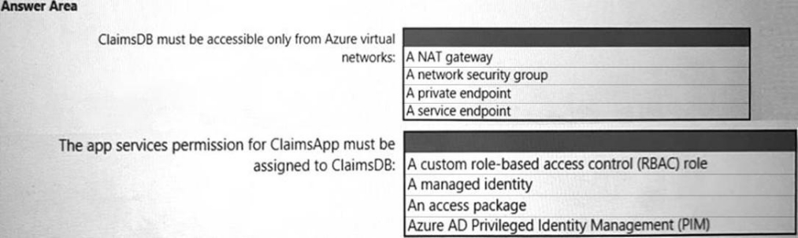
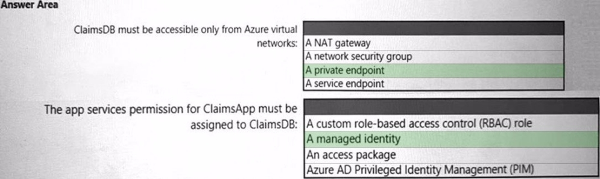
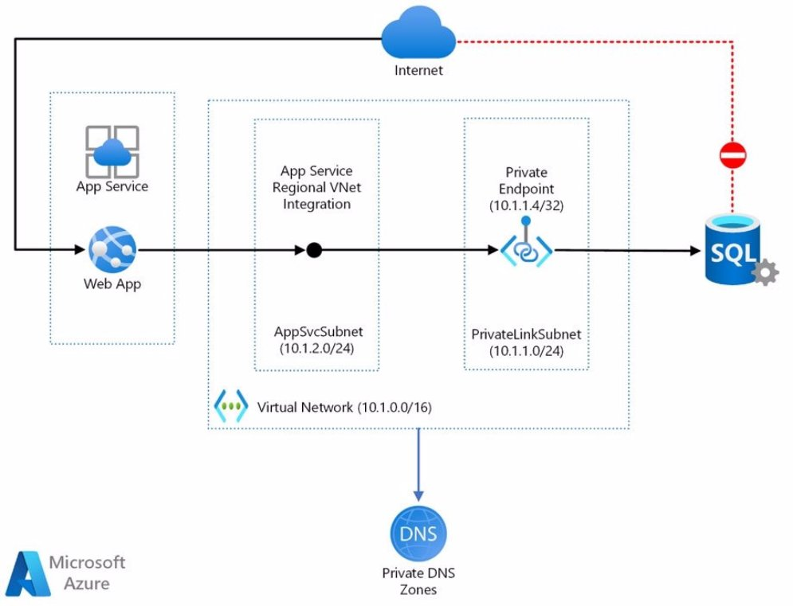

Question #1.

**Introductory Info**

Case Study -

This is a case study. Case studies are not timed separately. You can use as much exam time as you would like to complete each case. However, there may be additional case studies and sections on this exam. You must manage your time to ensure that you are able to complete all questions included on this exam in the time provided.

To answer the questions included in a case study, you will need to reference information that is provided in the case study. Case studies might contain exhibits and other resources that provide more information about the scenario that is described in the case study. Each question is independent of the other question in this case study.

At the end of this case study, a review screen will appear. This screen allows you to review your answers and to make changes before you move to the next section of the exam. After you begin a new section, you cannot return to this section.

To start the case study -

To display the first question in this case study, click the Next button. Use the buttons in the left pane to explore the content of the case study before you answer the questions. Clicking these buttons displays information such as business requirements, existing environment, and problem statements. If the case study has an All Information tab, note that the information displayed is identical to the information displayed on the subsequent tabs. When you are ready to answer a question, click the Question button to return to the question.

Overview -

Fabrikam, Inc. is an insurance company that has a main ofice in New York and a branch ofice in Paris.

Existing Environment. On-premises Environment

The on-premises network contains a single Active Directory Domain Services (AD DS) domain named corp.fabrikam.com. Existing Environment. Azure Environment

Fabrikam has the following Azure resources:

An Azure Active Directory (Azure AD) tenant named fabrikam.onmicrosoft.com that syncs with corp.fabrikam.com A single Azure subscription named Sub1

A virtual network named Vnet1 in the East US Azure region

A virtual network named Vnet2 in the West Europe Azure region

An instance of Azure Front Door named FD1 that has Azure Web Application Firewall (WAF) enabled

A Microsoft Sentinel workspace

An Azure SQL database named ClaimsDB that contains a table named ClaimDetails

20 virtual machines that are configured as application servers and are NOT onboarded to Microsoft Defender for Cloud A resource group named TestRG that is used for testing purposes only

An Azure Virtual Desktop host pool that contains personal assigned session hosts All the resources in Sub1 are in either the East US or the West Europe region.

Existing Environment. Partners -

Fabrikam has contracted a company named Contoso, Ltd. to develop applications. Contoso has the following infrastructure:

An Azure AD tenant named contoso.onmicrosoft.com

An Amazon Web Services (AWS) implementation named ContosoAWS1 that contains AWS EC2 instances used to host test workloads for the applications of

Fabrikam -

Developers at Contoso will connect to the resources of Fabrikam to test or update applications. The developers will be added to a security group named

ContosoDevelopers in fabrikam.onmicrosoft.com that will be assigned to roles in Sub1.

The ContosoDevelopers group is assigned the db\_owner role for the ClaimsDB database.

Existing Environment. Compliance Environment

Fabrikam deploys the following compliance environment:

Defender for Cloud is configured to assess all the resources in Sub1 for compliance to the HIPAA HITRUST standard.

C l h li i h h HIPAA HITRUST d d di d ll

Qualys is used as the standard vulnerability assessment tool for servers.

Existing Environment. Problem Statements

The secure score in Defender for Cloud shows that all the virtual machines generate the following recommendation: Machines should have a vulnerability assessment solution.

All the virtual machines must be compliant in Defender for Cloud.

Requirements. ClaimsApp Deployment

Fabrikam plans to implement an internet-accessible application named ClaimsApp that will have the following specifications: ClaimsApp will be deployed to Azure App Service instances that connect to Vnet1 and Vnet2.

Users will connect to ClaimsApp by using a URL of https://claims.fabrikam.com.

ClaimsApp will access data in ClaimsDB.

ClaimsDB must be accessible only from Azure virtual networks.

The app services permission for ClaimsApp must be assigned to ClaimsDB.

Requirements. Application Development Requirements

Fabrikam identifies the following requirements for application development:

Azure DevTest labs will be used by developers for testing.

All the application code must be stored in GitHub Enterprise.

Azure Pipelines will be used to manage application deployments.

All application code changes must be scanned for security vulnerabilities, including application code or configuration files that contain secrets in clear text.

Scanning must be done at the time the code is pushed to a repository.

Requirements. Security Requirements

Fabrikam identifies the following security requirements:

Internet-accessible applications must prevent connections that originate in North Korea.

Only members of a group named InfraSec must be allowed to configure network security groups (NSGs) and instances of Azure Firewall, WAF, and Front Door in Sub1.

Administrators must connect to a secure host to perform any remote administration of the virtual machines. The secure host must be provisioned from a custom operating system image.

Requirements. AWS Requirements -

Fabrikam identifies the following security requirements for the data hosted in ContosoAWS1:

Notify security administrators at Fabrikam if any AWS EC2 instances are noncompliant with secure score recommendations. Ensure that the security administrators can query AWS service logs directly from the Azure environment.

Requirements. Contoso Developers Requirements

Fabrikam identifies the following requirements for the Contoso developers:

Every month, the membership of the ContosoDevelopers group must be verified.

The Contoso developers must use their existing contoso.onmicrosoft.com credentials to access the resources in Sub1.

The Contoso developers must be prevented from viewing the data in a column named MedicalHistory in the ClaimDetails table. Requirements. Compliance Requirements

Fabrikam wants to automatically remediate the virtual machines in Sub1 to be compliant with the HIPAA HITRUST standard. The virtual machines in TestRG must be excluded from the compliance assessment.

**Question**

You need to recommend a solution to secure the MedicalHistory data in the ClaimsDetail table. The solution must meet the Contoso developer requirements.

What should you include in the recommendation?

1. row-level security (RLS)
1. Transparent Data Encryption (TDE)
1. Always Encrypted
1. data classification
1. dynamic data masking

**Correct Answer:** E

Scenario: The Contoso developers must be prevented from viewing the data in a column named MedicalHistory in the ClaimDetails table. Dynamic data masking (DDM) limits sensitive data exposure by masking it to non-privileged users. It can be used to greatly simplify the design and coding of security in your application.

Dynamic data masking helps prevent unauthorized access to sensitive data by enabling customers to specify how much sensitive data to reveal with minimal impact on the application layer. DDM can be configured on designated database fields to hide sensitive data in the result sets of queries. With DDM, the data in the database isn't changed. DDM is easy to use with existing applications, since masking rules are applied in the query results.

Incorrect:

Not B: Transparent Data Encryption (TDE) encrypts the entire database, not specific columns.

Reference:

https://docs.microsoft.com/en-us/sql/relational-databases/security/dynamic-data-masking

Community vote distribution

C (56%) E (43%)

Question #2.

**Introductory Info**

Case Study -

This is a case study. Case studies are not timed separately. You can use as much exam time as you would like to complete each case. However, there may be additional case studies and sections on this exam. You must manage your time to ensure that you are able to complete all questions included on this exam in the time provided.

To answer the questions included in a case study, you will need to reference information that is provided in the case study. Case studies might contain exhibits and other resources that provide more information about the scenario that is described in the case study. Each question is independent of the other question in this case study.

At the end of this case study, a review screen will appear. This screen allows you to review your answers and to make changes before you move to the next section of the exam. After you begin a new section, you cannot return to this section.

To start the case study -

To display the first question in this case study, click the Next button. Use the buttons in the left pane to explore the content of the case study before you answer the questions. Clicking these buttons displays information such as business requirements, existing environment, and problem statements. If the case study has an All Information tab, note that the information displayed is identical to the information displayed on the subsequent tabs. When you are ready to answer a question, click the Question button to return to the question.

Overview -

Fabrikam, Inc. is an insurance company that has a main ofice in New York and a branch ofice in Paris.

Existing Environment. On-premises Environment

The on-premises network contains a single Active Directory Domain Services (AD DS) domain named corp.fabrikam.com. Existing Environment. Azure Environment

Fabrikam has the following Azure resources:

An Azure Active Directory (Azure AD) tenant named fabrikam.onmicrosoft.com that syncs with corp.fabrikam.com A single Azure subscription named Sub1

A virtual network named Vnet1 in the East US Azure region

A virtual network named Vnet2 in the West Europe Azure region

An instance of Azure Front Door named FD1 that has Azure Web Application Firewall (WAF) enabled

A Microsoft Sentinel workspace

An Azure SQL database named ClaimsDB that contains a table named ClaimDetails

20 virtual machines that are configured as application servers and are NOT onboarded to Microsoft Defender for Cloud A resource group named TestRG that is used for testing purposes only

An Azure Virtual Desktop host pool that contains personal assigned session hosts All the resources in Sub1 are in either the East US or the West Europe region.

Existing Environment. Partners -

Fabrikam has contracted a company named Contoso, Ltd. to develop applications. Contoso has the following infrastructure:

An Azure AD tenant named contoso.onmicrosoft.com

An Amazon Web Services (AWS) implementation named ContosoAWS1 that contains AWS EC2 instances used to host test workloads for the applications of

Fabrikam -

Developers at Contoso will connect to the resources of Fabrikam to test or update applications. The developers will be added to a security group named

ContosoDevelopers in fabrikam.onmicrosoft.com that will be assigned to roles in Sub1.

The ContosoDevelopers group is assigned the db\_owner role for the ClaimsDB database.

Existing Environment. Compliance Environment

Fabrikam deploys the following compliance environment:

Defender for Cloud is configured to assess all the resources in Sub1 for compliance to the HIPAA HITRUST standard.

Currently, resources that are noncompliant with the HIPAA HITRUST standard are remediated manually.

Qualys is used as the standard vulnerability assessment tool for servers.

Existing Environment. Problem Statements

vulnerability assessment solution.

All the virtual machines must be compliant in Defender for Cloud.

Requirements. ClaimsApp Deployment

Fabrikam plans to implement an internet-accessible application named ClaimsApp that will have the following specifications: ClaimsApp will be deployed to Azure App Service instances that connect to Vnet1 and Vnet2.

Users will connect to ClaimsApp by using a URL of https://claims.fabrikam.com.

ClaimsApp will access data in ClaimsDB.

ClaimsDB must be accessible only from Azure virtual networks.

The app services permission for ClaimsApp must be assigned to ClaimsDB.

Requirements. Application Development Requirements

Fabrikam identifies the following requirements for application development:

Azure DevTest labs will be used by developers for testing.

All the application code must be stored in GitHub Enterprise.

Azure Pipelines will be used to manage application deployments.

All application code changes must be scanned for security vulnerabilities, including application code or configuration files that contain secrets in clear text.

Scanning must be done at the time the code is pushed to a repository.

Requirements. Security Requirements

Fabrikam identifies the following security requirements:

Internet-accessible applications must prevent connections that originate in North Korea.

Only members of a group named InfraSec must be allowed to configure network security groups (NSGs) and instances of Azure Firewall, WAF, and Front Door in Sub1.

Administrators must connect to a secure host to perform any remote administration of the virtual machines. The secure host must be provisioned from a custom operating system image.

Requirements. AWS Requirements -

Fabrikam identifies the following security requirements for the data hosted in ContosoAWS1:

Notify security administrators at Fabrikam if any AWS EC2 instances are noncompliant with secure score recommendations. Ensure that the security administrators can query AWS service logs directly from the Azure environment.

Requirements. Contoso Developers Requirements

Fabrikam identifies the following requirements for the Contoso developers:

Every month, the membership of the ContosoDevelopers group must be verified.

The Contoso developers must use their existing contoso.onmicrosoft.com credentials to access the resources in Sub1.

The Contoso developers must be prevented from viewing the data in a column named MedicalHistory in the ClaimDetails table. Requirements. Compliance Requirements

Fabrikam wants to automatically remediate the virtual machines in Sub1 to be compliant with the HIPAA HITRUST standard. The virtual machines in TestRG must be excluded from the compliance assessment.

**Question**

HOTSPOT -

You need to recommend a solution to meet the requirements for connections to ClaimsDB.

What should you recommend using for each requirement? To answer, select the appropriate options in the answer area. NOTE: Each correct selection is worth one point.

Hot Area:

**Correct Answer:**

Box 1: A private endpoint -

Scenario: An Azure SQL database named ClaimsDB that contains a table named ClaimDetails Requirements. ClaimsApp Deployment.

Fabrikamhave

- ClaimsApp will be deployed

Users will connect to ClaimsApp by using a URL of https://claims.fabrikam.com.

- ClaimsApp will access data in ClaimsDB.
- ClaimsDB must be accessible only from Azure virtual
- The app services permission for ClaimsApp must be assigned to ClaimsDB. Web

Architecture:

Workflow

1. Using Azure App Service regional VNet Integration, the web app connects to Azure through an AppSvcSubnet delegated subnet in an Azure Virtual
1. In this example, the VirtualVirtual

3. The App Service and Private Link subnets could be in separate peered Virtualpart
3. Azure Private Link sets up a private endpoint for the Azure SQL Database in the PrivateLinkSubnet of the Virtual
3. The web app connects to the SQL Database private endpoint through the PrivateLinkSubnet of the Virtual

The database firewall allows only traffic coming from the PrivateLinkSubnet to connect, making the database inaccessible from the public internet.

Box 2: A managed identity -

Managed identities for Azure resources provide Azure services with an automatically managed identity in Azure Active Directory. Using a managed identity, you can authenticate to any service that supports Azure AD authentication without managing credentials.

Reference:

https://docs.microsoft.com/en-us/azure/architecture/example-scenario/private-web-app/private-web-app https://docs.microsoft.com/en- us/azure/active-directory/managed-identities-azure-resources/managed-identities-status
