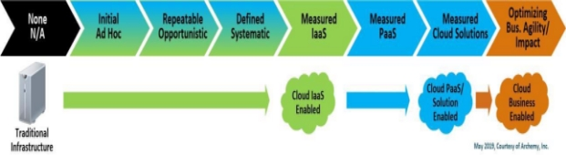
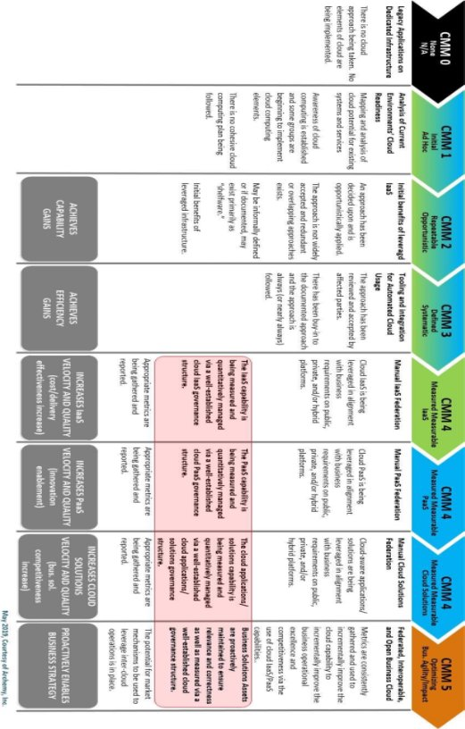
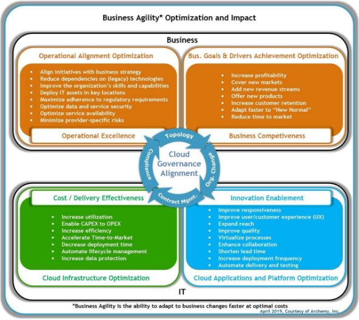
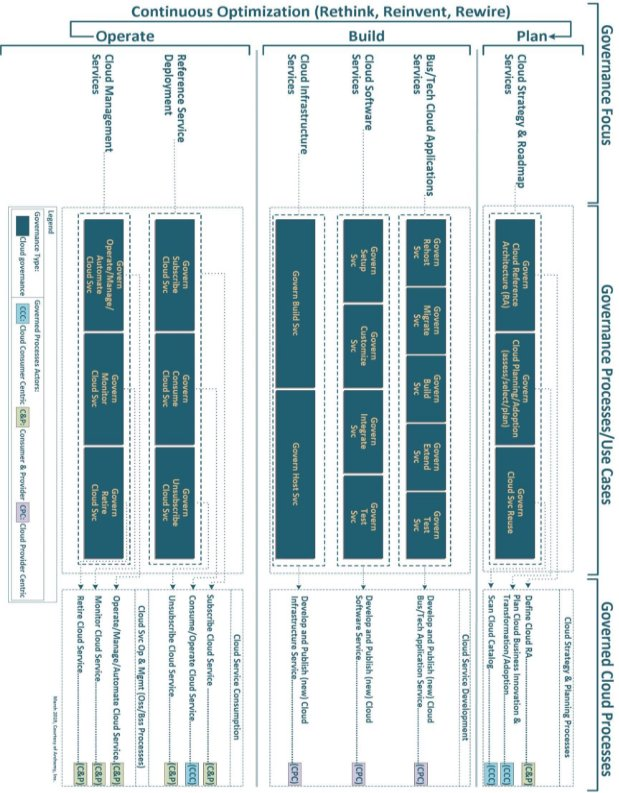



**Practical Guide to Cloud Governance** 

**Version 1.0**  

**A Discussion Paper from the OMG Cloud Working Group June 2019** 

**Document mars/2019-06-xx** 

This paper presents a discussion of technology issues considered in a Subgroup of the Object Management Group. The contents of this paper are presented to foster wider discussion on this topic; the content of this paper is not an adopted standard of any kind. This paper does not represent the official position of the Object Management Group. 

*This page intentionally left blank* 

**Table of Contents**

[Acknowledgements	 4 ](#_page3_x69.00_y180.00)

[Executive Overview 	 5 ](#_page4_x69.00_y72.00)

[Step 1: Understand – What is Cloud Governance?	 6 ](#_page5_x69.00_y275.00)

[The Need for Cloud Governance	 7 ](#_page6_x69.00_y72.00)

[Case Studies for Cloud Governance 	 7 ](#_page6_x69.00_y224.00)

[Step 2: Benchmark 	 8 ](#_page7_x69.00_y522.00)

[Measure the Organization’s Governance Maturity 	 8 ](#_page7_x69.00_y559.00)

[Benchmark for Business Agility 	 11 ](#_page10_x69.00_y72.00)

[Using Cloud Governance to Measure the “Goodness” of Cloud 	 12 ](#_page11_x69.00_y72.00)

[Step 3 – Establishing a Cloud Governance Framework 	 16 ](#_page15_x69.00_y72.00)

[Review of IT and Cloud Governance Models and Frameworks 	 16 ](#_page15_x69.00_y589.00)

[Leveraging Existing Cloud Governance Models and Frameworks 	 18 ](#_page17_x69.00_y72.00)

[A Suggested Cloud Adoption Governance Framework	 18 ](#_page17_x69.00_y259.00)

[Step 4 – Cloud Governance Alignment 	 21 ](#_page20_x69.00_y72.00)

[Step 5 – How to Establish A Cloud Governance Program 	 21 ](#_page20_x69.00_y506.00)

[Cloud Governance Charter and Operation 	 22 ](#_page21_x69.00_y279.00)

[Cloud Governance Program Roles and Responsibilities 	 22 ](#_page21_x69.00_y495.00)

[Minimum Activities to Stand up and Operate a Cloud Governance Program 	 23 ](#_page22_x69.00_y513.00)

[Step 6 – Establishing Governance Measures and Related Metrics	 25 ](#_page24_x69.00_y72.00)

[Step 7 – How do you sustain success? 	 30 ](#_page29_x69.00_y72.00)

[References 	 31 ](#_page30_x69.00_y72.00)

[Bibliography 	 31 ](#_page30_x69.00_y97.00)

[Standards and Governance Organizations	 32 ](#_page31_x69.00_y165.00)

[Other References 	 33 ](#_page32_x69.00_y72.00)

[Appendix: Governance Use Cases, Objectives and Outcomes 	 34 ](#_page33_x69.00_y92.00)© 2019 Cloud Standards Customer Council. All rights reserved. You may download, store, display on your computer, view, print, and link to the *Practical Guide to Cloud Governance* white paper at the OMG Cloud Working Group Web site, subject to the following: (a) the document may be used solely for your personal, informational, non-commercial use; (b) the document may not be modified or altered in any way; (c) the document may not be redistributed; and (d) the trademark, copyright or other notices may not be removed. You may quote portions of the document as permitted by the Fair Use provisions of the United States Copyright Act, provided that you attribute the portions to the OMG Cloud Working Group *Practical Guide to Cloud Governance* *(2019).*

**Acknowledgements** 

Development of the Practical Guide to Cloud Governance is a collaborative effort that brings together diverse customer-focused experiences and perspectives into a single guide for cloud customers. The following participants contributed significant expertise and time to this effort: 

- Karolyn Schalk (IBM) – editor 
- Claude Baudoin (cébé IT & Knowledge Management) 
- Christian Boudal, (IBM) 
- Jyoti Chawla (IBM) 
- Jean-Claude Franchitti (Archemy) 
- Shashank Heda (Wipro) 
- Nya Allison Murray (Trac-Car) 
- Osai Osaigbovo (IBM) 
- Mick Talley (University Bank) 
- Katy Warren (Mitre) 

Thanks to our other contributors: Ahmed Abdelaziz (IBM), Manish Bhatia (Wipro), Frank Chin 

(iTGRC), Fernando García Velasco (IBM), Maunang Mehta (Thomson Reuters), Kumail Morawala, Sumit Patel (IBM), Balaji Ramarajan (Cognizant), Anantha Rao (Wipro), Hariprasad Sasidharan V (Wipro), Karl Scott (Satori Consulting), Prasad Siddabathuni (Edifecs), Ajai Srivastava (Seven Step Consulting), Wisnu Tejasukmana (Schlumberger), Veera Venigalla (T-mobile),  and John Wooten (consultED). 

**Executive Overview** 

Governance is a loaded word. It can evoke negative responses and is often incorrectly defined as strategy, policy or procedure. Misconceptions about what governance is, the level of effort needed to set up a program, and how it supports day-to-day operations may be the greatest barriers to an organization embarking on this necessary work.  

The results of good governance are measurable; some studies show that organizations with above average IT governance have over 20% higher profits than those with inadequate governance following an otherwise similar IT strategy [1]. The importance of governance in ensuring successful, sustainable adoption of cloud computing and cloud services has been discussed in previous OMG Practical Guides and Publications, including the 2018 *Best Practices for Developing and Growing a Cloud-Enabled Workforce* [2], the 2016 *Practical Guide to Hybrid Cloud Computing* [3], and many others. What these guides will *not* do is offer specific guidance on how to plan and launch a governance program based on your specific needs. This publication fills this gap. 

The **Practical Guide to Cloud Governance** is written to help IT executives and their counterparts in the C-suite and lines of business speak to one another as they embark on cloud transformation.  Cloud governance demands a greater focus on business architecture, in the same way that successful cloud adoption is dependent on close alignment with business goals and strategy. Related organizational changes can be as challenging as the technical because: 

- The shared services model of the cloud is new to many organizations and requires standardization of approach. 
- Subscription and pay-as-you-go purchase models make new budgeting and financial strategies a necessity. 
- IT is no longer the sole owner of the technology service portfolio; IT advises the business and helps it innovate. 
- Staff manage services and Cloud Service Providers (CSPs) instead of assets. 
- In addition to technical complexities, staff will have to navigate new operating models. 
- The velocity of change increases by orders of magnitude, demanding agile organizational methods and capabilities. 

Cloud governance is not a “one and done” activity. To keep up with innovations in technology and business models, governance must be reviewed and maintained. The seven-step approach we recommend (see Figure 1) will serve you well throughout the lifecycle of your program. It can be followed asynchronously, the ability to execute several steps in parallel allowing you to move ahead efficiently. 

**Figure 1 -- Seven Evolutionary Steps to Execute and Sustain Cloud Governance**  

**Step 1: Understand – What is Cloud Governance?**

Governance, generically, may be defined as an agreed-upon set of policies and standards, which is: 

- based on a risk assessment and an-agreed upon framework, 
- inclusive of audit, measurement, and reporting procedures, as well as enforcement of policies and standards. 

In a multi-enterprise or multi-platform cloud environment, participants agree to promote and establish joint expectations for security and service levels. Governance will also define the process for any response to a breach of protocol, and the set of decision makers who are responsible for mitigation and communication. 

COBIT 5 [4], ISACA’s framework for enterprise IT governance and management, succinctly and effectively illustrates the fundamental differences and the feedback loops necessary for a successful program. 

***Figure 2 – Governance vs. Management*** 

**The Need for Cloud Governance**  

The introduction of cloud computing into an organization affects roles, responsibilities, processes and metrics. Without cloud governance in place to provide guidelines to navigate risk and efficiently procure and operate cloud services, an organization may find itself faced with these common problems: 

- Misalignment with enterprise objectives 
- Frequent policy exception reviews 
- Stalled projects 
- Compliance or regulatory penalties or failures 
- Budget overruns 
- Incomplete risk assessments 

**Case Studies for Cloud Governance** 

These anonymized case studies align with common high-level business and technical objectives, and illustrate why cloud governance is important. More granular governance use cases, applicable to specific processes used to plan, build and operate cloud-based solutions, are the Appendix.  

**Digital Transformation** 

Capybara Corp., a maker of custom sensor controls, initiated a major digital transformation project. The main goals were to reduce the overall infrastructure cost by limiting what is maintained in their private data centers, reduce the cost of software development, and simplify adoption of cloud-services in areas of analytics and machine learning. Capybara was already using some IaaS and SaaS, and had inserted some cloud guidance and controls into their financial and IT governance. The cloud guidance was confined to industry compliance and infrastructure standards. When different lines of business submitted their candidates for migration to the CIO’s transition team, the wide variance in assessment data and rationales raised a red flag. Assessments did not uniformly provide the following information: 

- Resource availability for development and application support 
- Capacity or growth forecasts for custom built applications 
- Performance benchmarking 
- Data residency or privacy needs 
- Availability of test data 
- Assessment of the team’s skill set to support cloud migration 

As a result, the CIO recognized the need to enhance existing cloud governance to assure successful migrations. Guided by current governance and available data, Capybara had the confidence to begin some transformation work in parallel with implementing new cloud governance controls: 

- Non-critical, commercial productivity applications used within a single country and with complete assessment packets could migrate to a cloud infrastructure. 
- Lines of business could move from traditional application licenses to SaaS for non-critical applications. 
- Enterprise architecture and development groups could begin using PaaS as a sandbox to explore analytics and machine learning capabilities and contribute to the creation of internal standards. 

A new, high-level transformation plan was created that kicked-off new transformation workstreams as draft cloud governance standards became available. 

**Compliance** 

The tax department of a major American city decided to migrate their system for collection, management and storage of tax forms from an on-premises solution, housed in a municipal data center, to a SaaS solution. This was the city’s first migration of a highly regulated system to the cloud. Tax forms contain information that is shared with the Internal Revenue Service (IRS). This Federal Tax Information (FTI) is managed according to IRS Publication 1075, which requires entities that handle FTI to submit attestation of controls 45 days ahead of bringing a new or changed system live. The migration project team waited until two weeks before their go-live date to engage their compliance officer in a controls review. As a result, the go-live was delayed by two months. Several governance gaps contributed to this failure: 

- Project governance did not include requirement for compliance reviews throughout project stages. 
- Procurement reviews operated independently of IT and departmental reviews. 
- The Compliance Office had not updated internal controls and guidance to include cloud services, and thus needed additional time to review the solution. 
- The project team made an assumption that the controls for cloud were the same as for their current solution. 

**Overage** 

XYZ Co., a mid-sized manufacturer of specialty electronics, acquired two smaller companies. XYZ uses a variety of cloud services to run their business, including an online order system, manufacturing execution and quality systems which integrate into the business intelligence services used to provide daily operational reports.  XYZ rapidly onboarded their new acquisitions into their primary systems. The first month after the onboarding was complete, cloud service costs were 30% higher than budgeted. The post-mortem revealed several missing elements of governance: 

- Oversight of IT purchases did not explicitly include Cloud Service Agreements (CSAs). 
- No review of cloud service terms was included on the acquisition checklist. 
- Usage was either uncapped, contracts included overage penalties, or the Cloud Service Providers were not required to immediately report overages. 
- No forecasts were made to calculate increased use. 

As a result, XYZ found itself with budget shortfalls and had to renegotiate their contracts.  

**Step 2: Benchmark**  

**Measure the Organization’s Governance Maturity** 

Maturity models are useful for assessing gaps in process and standards that interfere with establishing and maintaining IT and corporate governance. There are several maturity models to choose from: 

- The CMMI Institute’s Capability Maturity Model Integration (CMMI) has evolved from a model specific to software engineering into a model for assessing business maturity according to process and metrics [5]. 
- The COBIT maturity models encompass IT and IT governance, and are less complete in their consideration of business governance. 
- The Open Data Center Alliance (ODCA) offers a cloud maturity model, CMM 3.0, inclusive of the two key perspectives: business capabilities and technology capabilities. [6] 

Figure 3 illustrates a simple maturity model to help assess organizational readiness for cloud capabilities, with a goal of achieving business agility and impact. Active governance helps mitigate cloud adoption risks and aligns technology and business capabilities.  

**Figure 3 – Cloud Maturity Model with Progressive Levels of Maturity** 

Figure 4 (next page) adds detail and descriptions of each level of suggested cloud governance to the model illustrated in Figure 3. It emphasizes the importance of further developing and leveraging a governance structure (see area highlighted in pink) to achieve alignment of technology and business capabilities at CMM levels 4 and 5. 

Subsequent sections of this document present a generic cloud governance framework and explain how measures and metrics are used to guide technology and business alignment.  The same (green-blue- orange) color coding for the technology and business capabilities is used. 

Whether you choose an existing maturity model or build a model specific to your organization, what you are ultimately doing is assessing your security and compliance controls, scope of policies, definitions of technologies and definition of service types against the exemplars published by standards or best practices organizations. The Federal Information Processing Standard (FIPS) and National Institute of Standards (NIST) cloud computing controls and roadmap, and publications from the System and Organization Controls (SOC) and International Standards Organization (ISO) are typical starting points.  The section *Review of IT and Cloud Governance Models and Frameworks* identifies those that include business and financial controls.  

**Figure 4 - Descriptions of Each Level of the Cloud Maturity Model with Emphasis on Governance** 

**Benchmark for Business Agility** 

As the case studies in Step 1 show, achieving optimal business results depends on an adequate scope of governance – one that encompasses and anticipates risk. Figure 5 illustrates an approach to tightly link business results to governance processes. In this example, four categories of optimization initiatives, typical of cloud adoption, are shown along with how governance helps mitigate the most common risks and challenges they raise. Each general category includes sample optimization objectives, and a high- level strategic target. For example, one objective of an “Operational Alignment Optimization” initiative may be to “minimize provider-specific risks” and the high-level target is to achieve a quantifiable degree of “operational excellence.” The sample categories, objectives and targets can be modified to fit individual organizations’ initiatives. The objectives outlined in Figure 5 can also be inferred using the four perspectives[^1] set forth in the technology management balanced scorecard (BSC) methodology described in [7].  

**Figure 5 - Use Cloud Governance to Optimize Business Agility** 

1 

**Using Cloud Governance to Measure the “Goodness” of Cloud** 

A successful governance program consistently evaluates business progress and value to the organization.  This evaluation must be included both in an initial benchmark and in ongoing monitoring. Table 1 below sets forth broad categories for these measures. Actual measures and related metrics that roll up to these categories are discussed in the section *Establishing Measures and Metrics*. These are intended as guides to a specific organization’s adoption, as the role of an enterprise governance body includes refining or adding categories (and their related measures and metrics) to serve the specific needs of the business. 

**Table 1 – Suggested Measure Categories to Drive Positive Governance Outcomes** 

|||
| :- | :- |
|**Measure Category** |**Description** |
|||
|
1  Level of Cloud 

Computing Governance 
|Measures  in  this  category  help  establish  the  extent  to  which  cloud governance  is  in  place  across  the  enterprise  (aligns  with  BSC  [30] organizational agility perspective) |
|
2  Level of Cloud 

Adoption 
|Measures in this category can be tracked to determine the extent to which cloud has been adopted across the enterprise (aligns with BSC [30] service perspective). |
|
3  Operational 

Efficiency 
|Measures in this category can be used to track the parameters that drive the operational  efficiency  for  the  ongoing  sustenance  of  application  and infrastructure  components  in  the  cloud  (aligns  with  BSC  [30]  health perspective) |
|4  Cost Reduction |Measures  in  this  category  can  be  used  to  drive  the  funding  of  cloud transformations across the enterprise (aligns with BSC [30] IT-enabled health perspective) |
|5  Business Value Alignment |Measures in this category can be used to drive the extent to which cloud adoption  is  in  alignment  with  the  overall  business  objectives  for  the enterprise (aligns with BSC [30] outcome and value perceived by business) |
|6  Service-Driven Integration |Measures in this category can be used to track the extent to which the cloud deployment is building upon the existing services-based ecosystem (as per the service catalog) within the enterprise (aligns with BSC [30] IT-enabled service perspective and customer perceived service quality) |
|7  Mitigation |Measures in this category can be used to drive preventive measures that can be taken to avoid potential risks generated from cloud adoption (aligns with the BSC -based organizational health perspective in [7]) |
The various measure categories in Table 1 relate to the sample technical and business objectives set forth in Figure 1.  These relations are shown in Table 2 below (using the color coding introduced in Table 1). Table 2 also indicates the high-level target that would need to be quantified precisely. 

**Table 2 – Relationship Between Measure Categories and Sample Technical/Business Objectives** 

||||
| :- | :- | :- |
|**Optimization Initiatives Category** |` `**Sample Technical and Business Objectives** |**High-Level Target** |
||||
|Operational Alignment Optimization |
5  Align initiatives with business strategy 

6  Reduce dependencies on (legacy) technologies 

1  Improve the organization’s skills and capabilities 

3  Deploy IT assets in key locations 

7  Maximize compliance (privacy, IP protection, global 

liability, disaster recovery) 

7  Maximize adherence to regulatory requirements 7  Optimize data and service security 

3  Optimize service availability 

7  Minimize provider-specific risks 
|Operational Excellence |
|Business Goals and Drivers Achievement Optimization |
3  Increase profitability 

5  Cover new markets 

5  Add new revenue streams 

5  Offer new products 

6  Increase customer retention 2  Adapt faster to “New Normal” 1  Reduce time to market 
|Business Competitiveness |
|Cloud Infrastructure Optimization |
2  Increase utilization 

4  Enable CAPEX to OPEX 

3  Increase efficiency 

5  Accelerate Time-to-Market 

2  Decrease deployment time 

1  Automate lifecycle management 7  Increase data protection 
|Cost/Delivery Effectiveness |
|Cloud Applications and Platform Optimization |
3  Improve responsiveness 

5  Improve user/customer experience (UX) 5  Expand reach 

1  Improve quality 

2  Virtualize processes 

1  Enhance collaboration 

1  Shorten lead time 

6  Increase deployment frequency 

2  Automate delivery and testing 
|Innovation Enablement |
The balanced scorecard is a common management tool that can be applied to measuring governance performance. When measurement categories from the section *Benchmark for Business Agility* are combined with relevant measures and metrics, one can begin defining the weights for governance focus that will be unique to an organization’s own scorecard.  

**Table 3 – Suggested Measures and Related Metrics to Help Balance Governance** 

||||
| :- | :- | :- |
|**Measure Category** |**Description** |**Measures and Related Metrics** |
||||
|
1 

Level of Cloud Computing Governance 
|These measures help establish the extent to which cloud computing governance is in place across the enterprise |
- % of cloud-ability reviews exercised 

- % of service compatibility reviews exercised 

- % of service provider usage reviews exercised 

- Ratio of planned versus actual cloud services 

- Frequency of exceptions 

- Average time to educate and train all staff on new services available 

- Total number of DR tests per year for all apps 
|
|
2 

Level of Cloud Adoption 
|These measures can be tracked to determine the extent to which cloud computing has been adopted across the enterprise. |
- % of existing projects that are not part of cloud transformation 

- % of service requests 

- % of enterprise cloud services subscribed 

- Frequency of service usage 

- Average # of subscribers per service 

- % of SOA-based services consumed in cloud RA 

- Actual against expected consumption 

- % utilization of services (IaaS, SaaS, PaaS) 

- Percentage of consumption patterns (IaaS, SaaS, PaaS) 

- % of resources utilized 

- Rate of change to subscriber count 

- % of cloud apps available via mobile device 

- External customer Net Promoter scores 

- % of developers that have self-service access to cloud resources 
|
|
`  `3 

Operational Efficiency 
|These measures can be used to track the parameters that drive the operational efficiency for the ongoing sustenance of application and infrastructure components in the cloud |
- % of incidents reported 

- Average time to deploy 

- Average time to onboard 

- Spend on over-provisioning of cloud resources 

- Average time of VM in cloud environment 

- Average utilization of resources 
|

||||
| :- | :- | :- |
|**Measure Category** |**Description** |**Measures and Related Metrics** |
||||
|
4 

Cost Reduction 
|These measures can be used to drive the funding of cloud computing transformations across the enterprise |
- % of IT human resource utilization 

- % of IT infrastructure resource utilization       

- % of budget allocated to IT 

- % of cost reduced from moving applications into cloud environments 

- Delta between actual spending and budget 

- % of cloud resources repurposed from existing resources 
|
|
5 

Business Value Alignment 
|These measures can be used to drive the extent to which cloud computing adoption is in alignment with the overall business objectives for the enterprise |
- % of idle services decreased 

- % of services registered / # of services reused 

- % of business service-level requirements met 

- % of unsubscribed potential customers 

- Ratio of # of subscriptions/# of unsubscriptions 

- % of requirements addressed 

- Number of consumer/provider combinations impacted by exception 

- Total revenue generated by tech dpt. 

- % of cloud processes automated 

- Average time to deliver new services 
|
|
6 

Service-Driven Integration 
|These measures can be used to drive the extent to which cloud deployment is building upon the existing services- based ecosystem (as per the service catalog) within the enterprise |
- % of service provider exceptions/service provider integrations 

- % of unused services 

- % of enterprise services subscribed 

- % of redundant services 

- Number of SLAs impacted by exceptions 

- Number of service complaints 

- Average time-to-resolution 

- Average cloud-based application response time
|
|
7 

Risk Mitigation 
|These measures can be used to drive the extent to which preventive measures that can be taken to avoid potential risks generated from cloud adoption |
- % of compliance with security policies 

- % variance in schedule 

- Number of incidents related to unsubscribe 

- Severity of exceptions 

- Total number of contracts with single cloud provider 
|
**Step 3 – Establishing a Cloud Governance Framework** 

A cloud governance framework will need to operate in harmony with other corporate and IT governance practices. The level of effort to achieve this harmonization depends on how up-to-date the existing programs are in their controls and technology considerations, as well as with their scope.  

The categories of concern for cloud governance can be broadly summarized as: 

1. **Masked Complexity** associated with the integration of legacy environments, managing new and updated service workflows, microservices and event-driven applications, and managing multiple service providers as part of a single business or technical architecture.   
1. **Organizational Dynamics** as new ways to build, test and release software are introduced into the organization, along with the ease and simplicity with which lines of business may purchase XaaS.  
1. **Risks**: Increase in security and compliance considerations across environments as data is shared or systems are integrated. Complex systems combining offerings from multiple service providers create a potential for operational disruption if there are changes in provider(s). Financial exposure and indemnities for failure to meet contractual obligations also change. 
1. **Metrics:** new dynamics also means coming up with new ways to measure productivity, service levels and quality. 
1. **New Financial Models**: this includes understanding current accounting guidelines and designing financial strategy and policies to make the best decisions about when to capitalize SaaS or other cloud computing costs (in countries where it is allowed) vs. keeping them as an operating expense. It also includes the need to build guidance for when monetization of data is acceptable. 
1. **Capacity to Adapt:** lines of business, operational functions and technology each need guidelines on how to maintain data privacy, observe data residency rules, and protect intellectual property, while adopting new services or technologies. Business lines, in particular, must address how new technologies such as virtualization and artificial intelligence will change operations, and the speed at which these evolutions will take place. 

Figure 5 showed four main concerns of cloud governance alignment (blue arrows in the center). There is a mapping between those concerns and the risk listed above: 

- Compliance relates to no. 3, Risks 
- Contract management relates to no. 4, Metrics, and no. 5, New Financial Models 
- Topology links to no. 1, Hidden Complexity 
- Organizational Change links to no.2, Organizational Dynamics, and no. 6, Capacity to Adapt. 

**Review of IT and Cloud Governance Models and Frameworks** 

Commonly used governance models for Enterprise IT include COSO, COBIT, ISAE 3402, ISO 9000, ITGC, ITIL, CSA, and the Data Governance model. What differentiates them is focus and scope. 

- The Committee of Sponsoring Organizations (COSO) was the first formal governance model which framework defined internal controls “as a process, effected by an entity’s board of directors, management and other personnel, designed to provide reasonable assurance regarding the achievement of objectives in the following three categories: effectiveness and efficiency of operations, reliability of financial reporting, and compliance with applicable laws and regulations.” 
- COBIT, which consists of 34 different domains, covers only a small part of the COSO's components. Both offer guidance on stringent processes for financial controls. 
- Similarly, ISAE 3402 is dedicated to audit and assurance controls within a service organization, with an emphasis on its internal control framework for financial reporting. 
- ITGC falls within the category of General Computer Controls (GCC), defined as controls that relate to the environment within which computer-based application systems are developed, maintained and operated, and which are therefore applicable to all applications. 
- The Cloud Security Alliance (CSA) focuses on the entire life cycle of information security.  
- The United States Federal Government’s earlier Cloud First strategy has been superseded by Cloud Smart [8]. This program straddles ground between an adoption strategy and high-level governance framework. Its relevance is to government agencies and their suppliers. 
- Cloud-centric frameworks include [the J](https://collaboration.opengroup.org/jericho/cloud_cube_model_v1.0.pdf)ericho Cube Model and The Open Group Cloud Governance Framework. The Jericho Cube Model highlights the characteristics, benefits, and risks of various forms of cloud computing. The Open Group Cloud Governance Framework aims at defining the overarching processes, structures, and guidelines from the perspectives of key stakeholders such as the consumer, provider, and developer. 

Cloud Governance models from vendors are not covered here as they are generally biased towards individual products and lack a vendor-neutral and enterprise-wide perspective for controls. 

More analysis of the frameworks listed  above is available in the Open Group’s  *Landscape of Governance Models and  Standards* [9] which includes additional  models and frameworks, including ISO/IEC  38500, Risk IT, and the Balanced Scorecard  model.  There is also a subset of models and  frameworks including TOGAF 9.1  (architecture governance), COBIT 5, ITIL v3,  and The Open Group SOA Governance  Framework which help with specific cases of  business and IT alignment. These models  and frameworks vary in focus and overlap in  some areas as illustrated in Figure 6.  

**Figure 6 -- Governance Areas and Related Standards** 

**Leveraging Existing Cloud Governance Models and Frameworks** 

Some popular governance models, which were revised to include cloud computing and cloud service consumption, may have an information bias towards their original objectives. Consequently, they may not provide comprehensive coverage and insight on the different cloud service and consumption models. As an example, the Jericho Cube Model focuses on cloud consumers and describes how optimal cloud decisions may not be reached “without appropriate cloud-based identity, reputation, authentication, access and authorization, and governance and compliance.” [10] 

The Open Group Cloud Computing Framework “defines the overarching governance processes, structures, and guidelines across all the phases of cloud-based solutions from the perspectives of key stakeholders such as the consumer, provider, and developer.” [11] 

A framework that has a broader view of stakeholders will be better able to support current and desired state. *Users should seek out governance material that closely aligns to their intended business and IT goals.***   

**A Suggested Cloud Adoption Governance Framework** 

The Cloud governance framework suggested in Figure 7 (next page) aims at addressing the gaps and deficiencies identified above, and provides comprehensive cloud-centric governance for each phase of the cloud transformation life cycle. Users should be able to retrofit governance material that closely aligns to their intended business and IT goals to fit this suggested framework. 

The governed processes shown in the suggested governance framework are performed by Cloud Service Customers, Cloud Service Providers, or both, as shown in the legend at the bottom of the diagram. 

Table 4 on subsequent pages details the bands of the diagram (the Plan, Build, and Operate phases of the Cloud transformation lifecycle). The specific governance focus is identified, along with categories of cloud processes governed, and governance use cases that apply to individual  cloud processes within each category. Please refer to the Appendix for a detailed explanation of the objectives and outcomes that correspond to each one of the governance use cases shown in Table 4. 

**Figure 7 – Suggested Governance Framework** 

**Table 4 – Governance Foci, Processes Governed, and Use Cases** 

|**Governance Focus** |**Cloud Processes Governed** |**Governance Use Cases** |
| :- | - | :- |
|**Plan** |
**Cloud Strategy & Roadmap Definition** 

The cloud services governed are focused on helping define the “Approach to Cloud,” which entails strategizing and planning the use of business/technical solutions or applications, fog and edge Services, cloud platform/infrastructure services, and cloud software. These activities should involve the Cloud Service Provider(s). 
|
- Plan/Adopt 

- Reference Architecture 

- Service Reuse 
|
|**Build** |
**Cloud Solution / Application Service Development** 

The cloud services governed are focused on building business/technical solutions or application services “on cloud,” which covers IaaS or PaaS, Custom PaaS, SaaS, BPaaS (business process as a service\_, and other cloud services (“XaaS”). 
|
- Rehost 

- Migrate 

- Build 

- Extend 

- Test** 
|
||
**Cloud Software Service Usage** 

The cloud services governed are focused on building “cloud software services from cloud,” which covers third-party, SaaS, fog and edge services, cloud platform services, and on-demand solutions. 
|
- Setup 

- Customize 

- Integrate 

- Test 
|
||
**Cloud Infrastructure Service Usage** 

The cloud services governed are focused on using “infrastructure services for cloud,” which covers private IaaS, multi-tenant IaaS, virtual private cloud (VPC), and scalability- related solutions. 
|
- Build 

- Host 
|
|**Operate** |
**Cloud Service Deployment** 

The cloud services governed are focused on “leveraging clouds,” which covers business/technical solutions, applications, platform services, compute services (virtual machines, containers, microkernels), and storage services. 
|
- Subscribe 

- Consume 

- Unsubscribe 
|
||
**Cloud Service Management** 

The cloud services governed are focused on “management of clouds,” which covers business/technical solutions, applications, platform services, compute services (virtual machines, containers, microkernels), and storage services. 
|
- Operate / manage / automate 

- Monitor 

- Retire 
|
**Step 4 – Cloud Governance Alignment** 

While there are consistencies in IT operations and governance models globally, there is much less standardization for corporate governance models and frameworks, which differ by country. In the U.S., corporate governance is largely bound by state law, and for publicly traded companies, the Securities Exchange Commission (SEC). Internationally, compliance for both IT and corporate governance is often at the country level.  What this means for multi-national organizations is that the effort to align corporate governance to cover cloud governance might require more effort than to align IT governance.   

As the case studies in Step 1 illustrated, it is also important to align governance with compliance exposure, contractual obligations and other areas of risk. These include the four areas of risk listed in the center of Figure 5: 

- Business and IT Topologies 
- Compliance  
- Contract Management / SLA 
- Organizational Change 

Multiple OMG Cloud Working Group publications address risk and challenges in these areas: 

- In *Migrating Applications to Public Cloud Services: Roadmap for Success* [12]*,* Step 5 is called “Address Compliance, Security, Privacy and Data Residency Requirements. 
- In *Migrating Applications to the Cloud: Assessing Performance and Response Time Requirements* [13], Steps 2 is “Perform a Response Time Impact Assessment.” 
- In *Data Residency Challenges* [14], issues related to the location of data at rest or in transit are covered extensively. 
- In *Best Practices for Developing and Growing a Cloud-Enabled Workforce* [2], the risks related to lack of the skills needed for the cloud are addressed. 
- The *Practical Guide to Cloud Service Agreements* [15] and the companion discussion paper on *Public Cloud Service Agreements, What to Expect and What to Negotiate* [16] discuss the risks related to the misalignment between the cloud service customer (CSC) service needs and expectations and what the cloud service provider (CSP) offers in a CSA. 

**Step 5 – How to Establish A Cloud Governance Program** 

An organization will typically be using cloud services already, and looking for new ones, before it launches a formal cloud governance program. The impetus to establish the program is often in response to problems related to operating or procuring services.  One can organize the project scope, workstreams and timelines for a governance program launch as follows to meet the active needs of the enterprise and prepare for a future state: 

- Identify and engage the roles that will participate in the governance program. 
- Set the scope of the program charter broadly, to address future needs. Define project scope tightly, deliver program elements incrementally. 
- Organize separate project workstreams to assess what is in use and what is in play. Harmonize after immediate business needs are met. 
- Set immediate, minimum standards for monitoring and reporting. Evolve to meet goals of a comprehensive view of compliance status and alerts across the organization. 
- Establish a cycle of communication from the nascent governing body to management and the organization while the program is being formed.   
- Coordinate deliverables with deadlines for audits or compliance, especially if cloud governance is needed in response to known deficiencies. 

It is also essential to the success of the program that: 

- Resources are officially allocated to establish and sustain the program. Effective governance is not established or sustained in the margins. 
- Ownership and accountability for running and sustaining the program reside within the organization, not with third parties. 
- Communications and reports can be efficiently consumed and used. The work of the governance program must be recognized and trusted as correct, current, and authoritative. 

**Cloud Governance Charter and Operation** 

The Seven Evolutionary Steps (shown in Figure 1, and used as the outline of this Guide) are useful to consider when define the scope of the charter and operation of a cloud governance program. Keep the following principles in mind as you charter the program and document associated procedures: 

1. The organization’s business objectives must drive the scope of governance.  
1. Business and IT stakeholders must make the effort to understand one another’s domains so that decisions of what is included in governance are thorough and complete. 
1. All actors that participate in the cloud ecosystem must be considered. Governing rules for external parties must be clearly specified in a form (such as a Memorandum of Understanding [MoU], a Service Level Agreement [SLA], or a legally binding contract) that supports mutual understanding and agreement, and consistent use and enforcement. 
1. Cloud standards included in the governance framework should be open, consistent with, and complementary to standards prevalent in the industry. 

**Cloud Governance Program Roles and Responsibilities**

Steps 1 – 3 help in the identification of stakeholders. A RACI (responsible, accountable, consulted and informed) matrix is a simple way to keep track of coverage mapping for both governance and compliance. Table 5 shows an example with typical C-level assignments for the Board of Directors (BoD), Chief Executive Officer (CEO), Chief Operating Officer (COO), Chief Financial Officer (CFO), CIO, Chief Information Security Officer (CISO), and Chief Legal Officer (CLO) or General Counsel. These titles will vary across organizations, especially across countries, and may have different spans of control. 

**Table 5 – Sample RACI Matrix of a Cloud Governance Program** 

||**BoD** |**CEO** |**COO** |**CFO** |**CIO** |**CISO** |**CLO** |
| :- | - | - | - | - | - | - | - |
|Strategy & Use Case |I |C |R, A |C |R |C |C |
|Business Requirements |I |C |C |R, A |R |C |C |
|Compliance |I |C |R |R |R, A |R |C |
|Contracts & SLAs |I |I |R |I |C |C |R, A |
|Asset & Data Governance |I |C |C |I |R |R, A |I |
|Information & Data Management |I |C |C |I |R, A |R, A |I |
|Continuity & Elasticity |I |C |R, A |I |R |C |I |
|Technology & Service Provider Governance |I |C |C |I |R |R, A |R |
|Service Orchestration & Interoperability |I |C |R, A |C |R |R |I |
|IT Operations Management |I |C |R, A |C |R |R |I |
|Sustain Governance |I, C |C |R, A |R, A |R, A |R |C |
|Innovation or Transformation |I, C |C |R, A |I |R, A |R |R |
RACI charts for other key roles should be created that map upwards to the governance body. It is essential to consider the roles and relationships of external participants to internal as well.  

The *Practical Guide to Hybrid Cloud Computing* [3], beginning on page 17, lays out the internal and external roles and an approach to assessing existing compliance and governance frameworks based on the changes in responsibility and ownership that occur when particular types of cloud services are used and for hybrid and multi-cloud architectures. 

**Minimum Activities to Stand up and Operate a Cloud Governance Program** 

These activities are organized in Table 6 according to the seven steps followed in this Guide. 

**Table 6 – Minimum Activities in a Cloud Governance Program** 

|**Step** ||**Activities** ||
| - | :- | - | :- |
|**Understand** ||
U1.  Identify existing governance bodies. 

U2.  Ensure that the enterprise cloud computing strategy is in place. 

U3.  Review and map the cloud computing lifecycle to existing enterprise 

processes. 
||
|**Benchmark** ||
B1.  Identify gaps to close to meet the new cloud computing governance 

requirements. 

B2.  Identify the extent to which the governed processes are in place today and

ensure that associated governance processes are integrated into them. 

B3.  Associate internal resources to defined governance roles. 

B4.  Refine existing governance bodies or define new governance bodies to 

carry out governance processes. 
||
|**Framework** ||
F1.  Select or build a framework. 

F2.  Implement the framework as defined in Step 3. F3.  Governance charter – define the scope 
||
|**Align** ||
A1.  Assess where cloud topic should “have a seat” in the existing governance 

model. 

A2.  Propose change in the governance bodies and topics to be covered: 

a) Align the Governance bodies audience, RACI matrix 

b) Align the input / output of each governance bodies 

c) Align the flow between governance bodies 

A3.  Review the alignment with corporate governance. 
||
|**Program** ||
P1.  Define cloud measures and related metrics for the updated governance. 

P2.  Define or revise the communication plan to include where and how 

information related to the cloud transformation will be kept and made available. 

P3.  Ensure that appropriate risk, security and compliance review checkpoints 

are in place with the associated governing bodies. 
||
|**Measure** ||
M1. Select measures and metrics. 

M2. Begin to collect data as part of the cycle of communication and review. 
||
|**Sustain** ||
S1.  Evolve the governance processes along with the business outcomes and 

metrics. 

S2.  Review and align the balance score card using measures and metrics 

defined in this document. 

S3.  Review and align the balanced score card or other reporting provided to 

governance board** 
||
Adopters should plan on four to six weeks to establish a minimum viable program and implement associated changes, depending on the size of the company. 

**Step 6 – Establishing Governance Measures and Related Metrics** 

There is no single parameter or measure/metric that defines how well governance is working for all organizations. It is also likely that the organization will need to measure an incremental launch of cloud governance. We recommend beginning with the use cases itemized in Step 3, *Establishing A Cloud Governance Framework*, mapped to the governance phases and areas of the cloud solution lifecycle as illustrated in the tables below. The color coding used for the metrics corresponds to the colors used for the measure categories in Tables 1—3.    

**Table 7 – Governance Measures and Metrics** 

**Plan Governance Focus** 

||||
| :- | :- | :- |
|**Governance Area** |**Governance Use Cases** |**Measures and Related Metrics** |
||||
|**Strategy & Roadmap** |**Plan/Adopt** |
**4** % of budget allocated to IT 

**4** % of IT infrastructure resource utilization 

**4** % of IT human resource utilization 

6 % variance in schedule 

3 Average time to deploy 

3 Average time to onboard 

**1** Ratio of planned vs. actual cloud services 

**4** % of cost reduced from moving applications into cloud 

environments 

**4** Delta between actual spending and budget 

**5** Total revenue generated by tech dpt 

**2** External customer Net Promoter score 

**5** Average time to deliver new service 

**1** Average time to educate and train all staff on new services 

available 

**7** Total number of contracts with single cloud provider 
|
||**Reference Architecture** |
**5** % of business service level requirements met 

6 % of service provider exceptions /service provider integrations **2** % of SOA-based services consumed in Cloud RA 

**2** % of existing projects that are not part of Cloud transformation 
|
||**Service Reuse** |
**5** % of services registered / # of services reused 

**1** % of service compatibility reviews exercised 

**1** % of cloud-ability reviews exercised 

**5** % of idle services decreased 

**1** % of service provider usage reviews exercised 

**5** Total revenue generated by tech dpt 

**4** % of cloud resources repurposed from existing resources 
|
**Build Governance Focus** 

||||
| :- | :- | :- |
|**Governance Area** |**Governance Use Cases** |**Measures and Related Metrics** |
||||
|**Application Services Build** |**Rehost** |
**4** % of IT human resource utilization 

**4** % of budget allocated to IT 

**5** Average time to deliver new service 

**4** % of cost reduced from moving applications into cloud 

environments 

**5** Total revenue generated by tech dpt 

**4** Delta between actual spending and budget 

**1** Average time to educate and train all staff on new services 

available 

**2** % of developers that have self-service access to cloud resources 
|
||**Migrate** |
**4** % of IT human resource utilization 

**4** % of budget allocated to IT 

**5** Average time to deliver new service 

**4** % of cost reduced from moving applications into cloud 

environments 

**5** Total revenue generated by tech dpt 

**4** Delta between actual spending and budget 

**1** Average time to educate and train all staff on new services 

available 

**2** % of developers that have self-service access to cloud resources 
|
||**Build** |
**4** % of IT human resource utilization 

**4** % of budget allocated to IT 

**5** Average time to deliver new service 

**4** % of cost reduced from moving applications into cloud 

environments 

**5** Total revenue generated by tech dpt 

4 Delta between actual spending and budget 

**4** % of cloud resources repurposed from existing resources 

**1** Average time to educate and train all staff on new services 

available 

**2** % of developers that have self-service access to cloud resources 
|

||**Extend** |
**4** % of IT human resource utilization 

**4** % of budget allocated to IT 

**5** Average time to deliver new service 

**4** % of cost reduced from moving applications into cloud 

environments 

**5** Total revenue generated by tech dpt 

**4** Delta between actual spending and budget 

**1** Average time to educate and train all staff on new services 

available 

**2** % of developers that have self-service access to cloud resources 
|
| :- | - | - |
||**Test** |
**4** % of IT human resource utilization 

**4** % of budget allocated to IT 

**2** % of developers that have self-service access to cloud resources 3 Average time to onboard 
|
|**Software Services Build** |**Setup** |
**4** % of IT human resource utilization 

**4** % of budget allocated to IT 

**1** Average time to educate and train all staff on new services 

available 

**2** % of developers that have self-service access to cloud resources 
|
||**Customize** |
**4** % of IT human resource utilization 

**4** % of budget allocated to IT 

**5** Average time to deliver new service 

**4** % of cost reduced from moving applications into cloud 

environments 

**5** Total revenue generated by tech dpt 

**4** Delta between actual spending and budget 

**2** % of developers that have self-service access to cloud resources 
|
||**Integrate** |
**4** % of IT human resource utilization 

**4** % of budget allocated to IT 

**1** Average time to educate and train all staff on new services 

available 

**2** % of developers that have self-service access to cloud resources 
|
||**Test** |
**4** % of IT human resource utilization 

**4** % of budget allocated to IT 

**2** % of developers that have self-service access to cloud resources 3 Average time to onboard 
|

|**Infrastructure Services Build** |**Build** |
**4** % of IT human resource utilization 

**4** % of budget allocated to IT 

**5** Average time to deliver new service 

**4** % of cost reduced from moving applications into cloud 

environments 

**5** Total revenue generated by tech dpt 

**4** Delta between actual spending and budget 

**4** % of cloud resources repurposed from existing resources 

**1** Average time to educate and train all staff on new services 

available 

**2** % of developers that have self-service access to cloud resources 
|
| - | - | - |
||**Host** |
**4** % of IT human resource utilization 

**4** % of budget allocated to IT 

**5** Average time to deliver new service 

**4** % of cost reduced from moving applications into cloud 

environments 

**5** Total revenue generated by tech dpt 

**4** Delta between actual spending and budget 

**1** Average time to educate and train all staff on new services 

available 

**2** % of developers that have self-service access to cloud resources 
|
**Operate Governance Focus** 

||||
| :- | :- | :- |
|**Governance Area** |**Governance Use Cases** |**Measures and Related Metrics** |
||||
|**Service Deployment** |**Subscribe** |
6 % of enterprise services subscribed 

**2** % of enterprise cloud services subscribed **7** % of compliance with security policies 

**2** % of cloud apps available via mobile device 
|
||**Consume** |
**2** Actual against expected consumption 

**2** Percentage of consumption patterns (IaaS, SaaS, PaaS) 

**1** Frequency of exceptions 

**7** Severity of exceptions 

**5** Number of consumer/provider combinations impacted by 

exceptions 

6 Number of SLAs impacted by exceptions 
|
||**Unsubscribe** |
**2** Average # of subscribers per service 

**2** Rate of change to subscriber count 

6 % of unused services 

**5** Ratio of # of subscriptions / # of un-subscriptions **5** % of unsubscribed potential customers 

**7** Number of incidents related to unsubscribe 
|
|**Management Service** |**Operate/Ma nage/Auto mate** |
**5** % of requirements addressed 

**2** % utilization of services (IaaS, SaaS, PaaS) 

**2** % of resources utilized 

**2** % of service requests 

3 % of incidents reported 

6 Average time-to-resolution 

**5** % of cloud processes automated 

**1** Total number of DR tests per year for all apps 

**7** Total number of contracts with single cloud provider 
|
||**Monitor** |
**2** % of developers that have self-service access to cloud resources 6 Average cloud-based application response time 

3 Spend on over-provisioning of cloud resources 

3 Average time of VM in cloud environment 
|
||**Retire** |
**2** Frequency of service usage 

6 % of unused services 

6 % of redundant services 

3 Average utilization of resources 3 # of incidents reported 

6 Number of service complaints 
|
**Step 7 – How do you sustain success?** 

Industries, compliance, markets, organizations, cloud computing are all dynamic. To keep up with change, there are minimum activities and metrics that should be part of your initial program charter and procedures from the start. Those minimum activities include: 

1. A regular assessment of the cloud governance program. Once a year is usually enough. It is best to time the publication of the review and assessment report to provide insight for such things as contract reviews, meetings of the external board, audits, applications for accreditation and annual reports. 
1. An ongoing collection and review of data to compare to benchmarks. A quarterly collection and publication of results is most effective. 
1. Frequent, two-way communication on the governance program. Solicit feedback, respond to feedback. 
1. Education on how to use governance controls in day-to-day operations. 
1. Maintain a backlog of governance improvement actions to increase the level of maturity and fix issues discovered during the assessment 

The metrics, key performance indicators (KPIs) and activities necessary to sustain a governance program should be built in from the start. The kinds of KPIs and metrics that support the value and evolution of the cloud governance program include at minimum: 

1. Ratio of planned versus actual cloud services 
1. Frequency of exceptions to policies 
1. Operational Efficiency 
1. Average time to onboard 
1. Cost reduction 
1. % of total and departmental budgets allocated to cloud services. 
1. Business  Value  Alignment  –  how  this  will  be  measured  is  dependent,  in  part,  on  how  the organization measures project results (earned vs. planned value, cost variance, etc.) 
1. Used vs. idle cloud services 
1. % of business service-level requirements met 

**References**

**Bibliography** 

Note: Practical Guides and White Papers originally distributed by the Cloud Standards Customer Council (CSCC) are listed below as being from the Object Management Group, following the reorganization of the CSCC as the OMG’s Cloud Working Group in 2018. 

1. Weil, Peter and Jeanne W. Ross: *IT Governance, How Top Performers Manage IT Decisions Rights for Superior Results.* MIT Center for Information Systems Research, 2004. [https://www.amazon.com/dp/B004OC07CQ/ ](https://www.amazon.com/dp/B004OC07CQ/)
1. Object Management Group: *Best Practices for Developing and Growing a Cloud-Enabled Workforce.* May 2018.[ https://www.omg.org/cloud/deliverables/best-practices-for-developing-and-growing-a- cloud-enabled-workforce.htm ](https://www.omg.org/cloud/deliverables/best-practices-for-developing-and-growing-a-cloud-enabled-workforce.htm) 
1. Object Management Group: *Practical Guide to Hybrid Cloud Computing.* February 2016. *[https://www.omg.org/cloud/deliverables/practical-guide-to-hybrid-cloud-computing.htm ](https://www.omg.org/cloud/deliverables/practical-guide-to-hybrid-cloud-computing.htm)*
1. ISACA: *COBIT 5*.[ http://www.isaca.org/COBIT/pages/cobit-5.aspx.](http://www.isaca.org/COBIT/pages/cobit-5.aspx) 

(COBIT was originally an acronym for “Control Objectives for Information and related Technology.” Since its introduction in 1996, the framework has expanded and COBIT is now used as the name of the framework, not as an acronym.) 

5. CMMI Institute (an ISACA Enterprise): *Introducing CMMI® V2.0*.[ https://cmmiinstitute.com/cmmi ](https://cmmiinstitute.com/cmmi) 
5. Open Data Center Alliance: *Cloud Maturity Model 3.0.[ http://opendatacenteralliance.org/ ](http://opendatacenteralliance.org/)*(access requires membership) 
5. Nelson, Lauren E., and Sophia I. Vargas: *Develop Cloud Metrics Using the Balanced Scorecard*. In “Performance Management: The Cloud Computing Playbook,” Forrester report, February 2018. [https://www.forrester.com/report/Develop+Cloud+Metrics+Using+The+Balanced+Scorecard/-/E- RES61604# ](https://www.forrester.com/report/Develop+Cloud+Metrics+Using+The+Balanced+Scorecard/-/E-RES61604)(access requires membership or payment) 
5. Office of the Federal Chief Information Officer: *Federal Cloud Computing Strategy.* [https://cloud.cio.gov/ ](https://cloud.cio.gov/) 
5. The Open Group: *Landscape of Governance Models and Standards*. [http://www.opengroup.org/cloud/gov_snapshot/p3.htm ](http://www.opengroup.org/cloud/gov_snapshot/p3.htm) 
5. Jericho Forum™: *Cloud Cube Model: Selecting Cloud Formations for Secure Collaboration.* Position paper, 2009.[ https://collaboration.opengroup.org/jericho/cloud_cube_model_v1.0.pdf ](https://collaboration.opengroup.org/jericho/cloud_cube_model_v1.0.pdf) 
5. The Open Group: *Cloud Computing Governance Framework. [http://www.opengroup.org/cloud/gov_snapshot/index.htm ](http://www.opengroup.org/cloud/gov_snapshot/index.htm)* 
5. Object Management Group: *Migrating Applications to Public Cloud Services: Roadmap for Success V2.0.* February 2018.[ https://www.omg.org/cloud/deliverables/migrating-applications-to-public- cloud-services-roadmap-for-success.htm ](https://www.omg.org/cloud/deliverables/migrating-applications-to-public-cloud-services-roadmap-for-success.htm) 
5. Object Management Group: *Migrating Applications to the Cloud: Assessing Performance and Response Time Requirements.* October 2014.[ https://www.omg.org/cloud/deliverables/migrating- applications-to-the-cloud-assessing-performance-and-response-time-requirements.htm ](https://www.omg.org/cloud/deliverables/migrating-applications-to-the-cloud-assessing-performance-and-response-time-requirements.htm) 

]14]  Object Management Group: *Data Residency Challenges.* May 2017. 

[https://www.omg.org/cloud/deliverables/data-residency-challenges.htm ](https://www.omg.org/cloud/deliverables/data-residency-challenges.htm) 

15. Object Management Group: *Cloud Working Group Practical Guide to Cloud Service Agreements v3.0.* March 2019. [ https://www.omg.org/cloud/deliverables/practical-guide-to-cloud-service- agreements.htm ](https://www.omg.org/cloud/deliverables/practical-guide-to-cloud-service-agreements.htm)
15. Object Management Group: *Public Cloud Service Agreements, What to Expect and What to Negotiate, v2.0.[* https://www.omg.org/cloud/deliverables/public-cloud-service-agreements-what- to-expect-and-what-to-negotiate.htm ](https://www.omg.org/cloud/deliverables/public-cloud-service-agreements-what-to-expect-and-what-to-negotiate.htm)*

**Standards and Governance Organizations** 

**Cloud Security Alliance (CSA),[ https://cloudsecurityalliance.org/ ](https://cloudsecurityalliance.org/)**

A not-for-profit organization with a mission to promote the use of best practices for providing security assurance within Cloud Computing, and to provide education on the uses of Cloud Computing to help secure all other forms of computing. The CSA is led by a broad coalition of industry practitioners, corporations, associations and other key stakeholders. Relevant guidance materials include: 

- Security Guidance for Critical Areas of Focus in Cloud Computing v.3.0 
- Cloud Controls Matrix v.1.2 

**European Network and Information Security Agency (ENISA),[ https://www.enisa.europa.eu ](https://www.enisa.europa.eu/)**

The European Union's response to cybersecurity concerns. It is therefore a pacesetter for the security of information in Europe and a center of expertise. Their objective is to make ENISA’s website the European hub for exchange of information, best practices and knowledge in the field of information security. Relevant guidance materials include: 

- Cloud Computing Risk Assessment 
- Cloud Computing Information Assurance Framework 

**ISACA,[ https://www.isaca.org/ ](https://www.isaca.org/)**

An independent, non-profit, global association that engages in the development, adoption and use of globally accepted, industry-leading knowledge and practices for information systems. Relevant guidance materials include: 

- IT Control Objectives for Cloud Computing 
- Controls and Assurance in the Cloud: Using COBIT 5 
- Cloud Computing: Business Benefits with Security, Governance and Assurance Perspectives. 

**National Institute of Standards and Technology (NIST),[** https://www.nist.gov/ ](https://www.nist.gov/)**

A non-regulatory federal agency within the U.S. Department of Commerce. NIST’s mission is to promote US innovation and industrial competitiveness by advancing measurement science, standards and technology in ways that enhance economic security and improve quality of life. Relevant guidance materials include: 

- NIST Special Publication 800-145 The NIST Definition of Cloud Computing, September 2011, 
- NIST Special Publication 500-293, US Government Cloud Computing Technology Roadmap, Release 1.0 (Draft), Volume I, High-Priority Requirements to Further USG Agency Cloud Computing Adoption; and Volume II, Useful Information for Cloud Adopters. 

**Other References** 

- Andersen, Peter, Per Svejvig, and Lise T. Heeager: *Ambidextrous IT Governance: The Art of Balancing Exploration and Exploitation in IT Governance*. December 2017. [https://aisel.aisnet.org/cgi/viewcontent.cgi?article=1009&context=iris2017 ](https://aisel.aisnet.org/cgi/viewcontent.cgi?article=1009&context=iris2017)  
- Cloud Security Alliance: *Security Guidance for Critical Areas of Focus in Cloud Computing v.3.0.* 2011.[ https://downloads.cloudsecurityalliance.org/assets/research/security- guidance/csaguide.v3.0.pdf ](https://downloads.cloudsecurityalliance.org/assets/research/security-guidance/csaguide.v3.0.pdf)  
- Deloitte Consulting & CIOnet: *Cloud Adoption Study*. May 2011. 
- Deloitte Consulting: *Developing an effective governance operating model – A guide for financial services boards and management teams.* March 2013. [https://www2.deloitte.com/content/dam/Deloitte/global/Documents/Financial-Services/dttl- fsi-US-FSI-Developinganeffectivegovernance-031913.pdf ](https://www2.deloitte.com/content/dam/Deloitte/global/Documents/Financial-Services/dttl-fsi-US-FSI-Developinganeffectivegovernance-031913.pdf)
- Gartner: *Magic Quadrant for Integrated Risk Management.* July 2018. [https://www.gartner.com/doc/reprints?id=1-57SVSSC&ct=180718&st=sb&aliId=773378292 ](https://www.gartner.com/doc/reprints?id=1-57SVSSC&ct=180718&st=sb&aliId=773378292)
- Ponemon Institute: *The True Cost of Compliance*. January 2011. 
- Ponemon Institute: *Data Security in the Cloud: Survey of US IT Operations, IT Security and Compliance Practitioners.* 

**Appendix: Governance Use Cases, Objectives and Outcomes** 

**Plan Governance Focus – Cloud Strategy & Roadmap Definition Governance Use Cases** 

|||
| :- | :- |
|**Governance Use Case** |**Governance Use Case Objective and Outcome** |
|||
|**Plan/Adopt** |
||Outcome: Consistency in cloud adoption and transformation across the enterprise with consistent adherence to cloud strategy with the ability to continuously track the Business value of Cloud. (ROI is $ focus, while cloud is not a cost focus only, more supporting Time to market need) |
|**Reference Architecture** |
|||
|**Service Reuse** |
|||
**Build Governance Focus – Cloud Solution/Application Service Development Governance Use Cases** 

|||
| :- | :- |
|**Governance Use Case** |**Governance Use Case Objective and Outcome** |
|||
|**Rehost** |
||Outcome: Successful rehosting of solutions / applications in alignment with the organization’s cloud solution / application and data governance approaches, cloud governance tooling, and DevOps / CloudOps processes, as applicable, to meet business and financial objectives. |
|**Migrate** |
||Outcome: Successful migration of solutions / applications in alignment with the organization’s cloud solution / application and data governance approaches, cloud governance tooling, and DevOps / CloudOps processes, as applicable, to meet business and financial objectives. |
|**Build** |
|||
|**Extend** |
|||

|||
| :- | :- |
|**Governance Use Case** |**Governance Use Case Objective and Outcome** |
|||
|**Test** |
||Outcome: Successful testing of solutions / applications development in alignment with the organization’s cloud solution / application and data governance approaches, cloud governance tooling, data governance, and DevOps / CloudOps processes, as applicable, to meet business and financial objectives. |
**Build Governance Focus – Cloud Software Service Usage Governance Use Cases**  

|||
| :- | :- |
|**Governance Use Case** |**Governance Use Case Objective and Outcome** |
|||
|**Setup** |
||Outcome: Successful setup of cloud software services in alignment with the organization’s cloud solution / application and data governance approaches data governance approaches, cloud governance tooling, and DevOps / CloudOps processes, as applicable, to meet business and financial objectives. |
|**Customize** |
|||
|**Integrate** |
||Outcome: Successful integration of cloud software services with cloud solutions / applications in alignment with the organization’s cloud solution / application and data governance approaches to meet business and financial objectives. |

|||
| :- | :- |
|**Governance Use Case** |**Governance Use Case Objective and Outcome** |
|||
|**Test** |
||Outcome: Successful testing of cloud software services in alignment with the organization’s cloud solution / application and data governance approaches, cloud governance tooling, data governance, and DevOps / CloudOps processes, as applicable, to meet business and financial objectives. |
**Build Governance Focus – Cloud Infrastructure Service Usage Governance Use Cases:** 

|||
| :- | :- |
|**Governance Use Case** |**Governance Use Case Objective and Outcome** |
|||
|**Build** |
Ensure that the configuration and commissioning of cloud infrastructure services for use in a multi-cloud environment is performed according to systemic and holistic infrastructure management policies set forth and adopted by the organization around the use of cloud resources, such as storage, network, memory, and compute. 

Outcome:  Successful  configuration  of  cloud  infrastructure  services  in alignment with the organization’s infrastructure governance approach to meet business and financial objectives. 
|
|**Host** |
Ensure  that  the  hosting  of  cloud  solutions  /  applications  on  a  cloud infrastructure  in  a  multi-cloud  environment  abides  to  infrastructure management policies set forth and adopted by the organization around the  use  of  cloud  resources,  such  as  storage,  network,  memory,  and compute. 

Outcome: Successful hosting of cloud solutions / applications on a scalable cloud infrastructure in alignment with the organization’s infrastructure governance approach, cloud governance tooling, data governance, and DevOps  /  CloudOps  processes,  as  applicable,  to  meet  business  and financial objectives. 
|
**Operate Governance Focus – Cloud Service Deployment Governance Use Cases** 

|||
| :- | :- |
|**Governance Use Case** |**Governance Use Case Objective and Outcome** |
|||
|**Subscribe** |
|||
|**Consume** |
||Outcome: Ability to demonstrate quantifiably measurable proof that the right service was subscribed to, and that it is achieving expected business outcomes (e.g., functional, financial). Both the cloud service consumer and provider  are  able to  utilize  (operate) the  service  reliably  and meet  SLA commitments. |
|**Unsubscribe** |
|||
` `**Operate Governance Focus – Cloud Service Management Governance Use Cases** 

|||
| :- | :- |
|**Governance Use Case** |**Governance Use Case Description Objective and Outcome** |
|||
|**Operate / Manage / Automate** |
|||
|**Monitor** |
|||

|**Retire** |
| - |
|||

Copyright © 2019 Object Management Group  Page 39 

[^1]: Outcome (create direct and indirect business value), service (improve internal and external customer satisfaction), agility (improve speed, flexibility and adaptability), and health (optimize financial and process efficiency). 